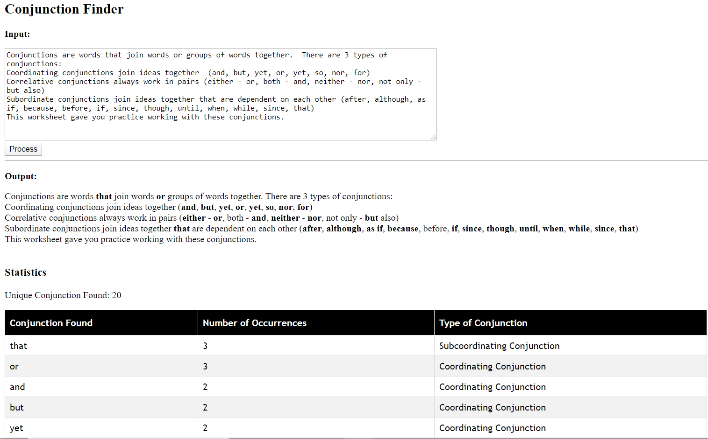

# dfa-for-conjunction-finder

[](https://github.com/RichardLitt/standard-readme)

This project is a localhost web application that utilizes Deterministic Finite Automata as a conjunction finder and find patterns from the user input file.

It has visualizations as one of the outputs, such as emboldened pattern(s), statistics with number of occurrences of pattern(s) found

## Table of Contents

- [Install](#install)
- [Usage](#usage)
- [API](#api)
- [Maintainers](#maintainers)

## Install

Download the whole project to use

Python 3 and NPM should be installed

## Usage

Run the servers with
```
node server.js
```
and
```
python api.py
```

And you are good to go with opening main.html in your browser

## API

There are TWO internal APIs to be utilized at the moment.

```
/readtext
```
and
```
/api/?text=
```

## Output


## Maintainers

[@FooKaiWen](https://github.com/FooKaiWen)

Small note: If editing the README, please conform to the [standard-readme](https://github.com/RichardLitt/standard-readme) specification.
